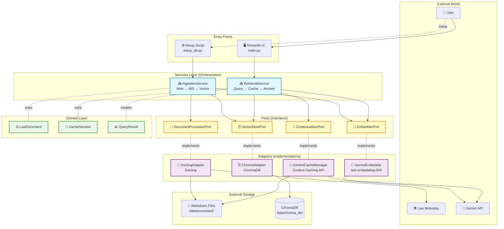
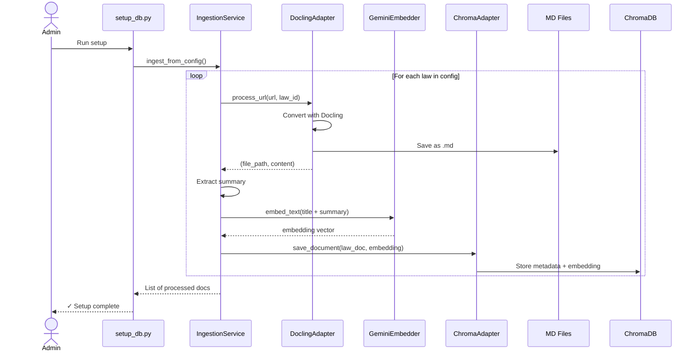
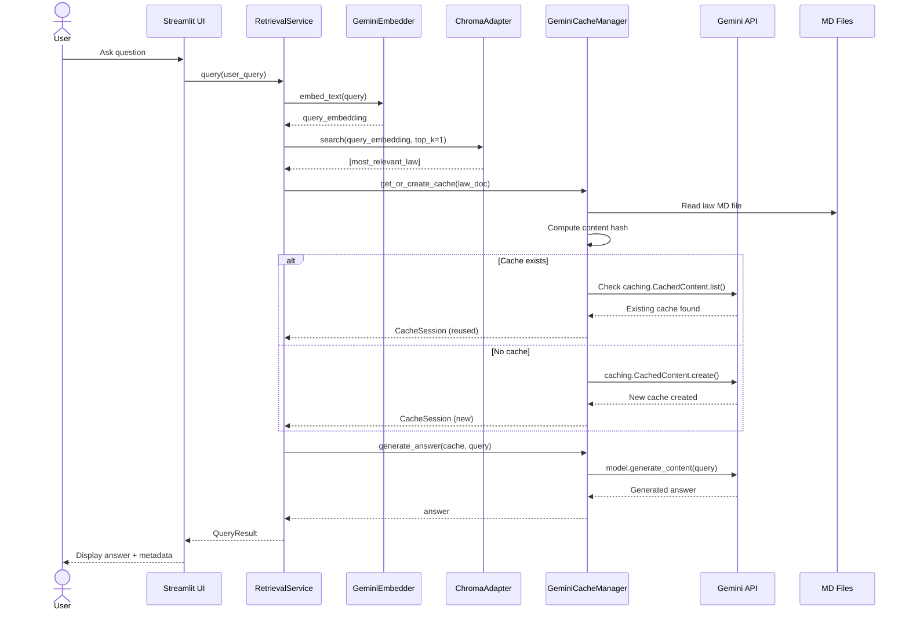

# Legal AI RAG System - Architecture Documentation

## Overview

This system implements a **NotebookLM-inspired Legal AI RAG** for Argentine Social Security Laws using **Hexagonal Architecture** (Ports & Adapters pattern).

**Key Innovation:** Document-level retrieval with Gemini Context Caching instead of traditional chunk-based RAG.

## Architecture Diagram



## Data Flow Diagrams

### Ingestion Flow (One-time Setup)



### Retrieval Flow (User Query)



## Design Decisions

### 1. Document-Level vs. Chunk-Level RAG

**Decision:** Store entire laws in Gemini Cache instead of chunking.

**Rationale:**
- Laws need complete context to answer correctly
- Gemini 1.5 Pro supports 2M token context window
- Context Caching reduces cost by ~90% for repeated queries
- Simpler architecture (no chunk merging logic needed)

**Trade-offs:**
- ✅ Higher answer quality (full context)
- ✅ 90% cost reduction after cache creation
- ✅ Faster responses on cache hit (<1s)
- ❌ Higher initial cost to create cache
- ❌ Only works for documents that fit in context window

### 2. Hexagonal Architecture

**Decision:** Strict separation of Ports (interfaces) and Adapters (implementations).

**Rationale:**
- Easy to swap implementations (e.g., different vector DB)
- Testable with mocks
- Clear dependency flow (Domain ← Services ← Ports → Adapters)

**Example:** If we want to switch from ChromaDB to Pinecone, we only change `ChromaAdapter` without touching services.

### 3. Vector Store Strategy

**Decision:** Index only title + summary, store file path in metadata.

**Rationale:**
- Vector DB becomes a lightweight "table of contents"
- Full content loaded from files when needed
- Faster indexing and cheaper storage

### 4. Cache Management

**Decision:** 1-hour TTL with content hash validation.

**Rationale:**
- Laws rarely change (1 hour is reasonable)
- Content hash prevents stale caches on updates
- Automatic cache reuse across sessions

## Cost Analysis

### Traditional RAG (No Caching)

For a medium law (~50k tokens):

| Query # | Input Tokens | Output Tokens | Cost (USD) |
|---------|--------------|---------------|------------|
| Query 1 | 50,000       | 500           | $0.75      |
| Query 2 | 50,000       | 500           | $0.75      |
| Query 3 | 50,000       | 500           | $0.75      |
| **Total (3 queries)** | **150,000** | **1,500** | **$2.25** |

### With Context Caching

| Query # | Input Tokens | Cached Tokens | Output Tokens | Cost (USD) |
|---------|--------------|---------------|---------------|------------|
| Cache creation | 50,000 | - | - | $0.50 |
| Query 1 | 100 | 50,000 | 500 | $0.05 |
| Query 2 | 100 | 50,000 | 500 | $0.05 |
| Query 3 | 100 | 50,000 | 500 | $0.05 |
| **Total (3 queries)** | **50,300** | **150,000** | **1,500** | **$0.65** |

**Savings:** ~71% cost reduction for 3 queries, ~90% per query after cache creation.

## Technology Stack

| Component | Technology | Purpose |
|-----------|-----------|---------|
| LLM | Gemini 1.5 Pro | Answer generation with context caching |
| Embeddings | text-embedding-004 | Semantic search |
| Document Processing | Docling (IBM) | Web → Markdown conversion |
| Vector DB | ChromaDB | Local vector storage |
| Web UI | Streamlit | User interface |
| Configuration | Pydantic Settings | Environment management |

## File Structure

```
rag_app/
├── config/              # Configuration
│   ├── leyes_config.json
│   └── settings.py
├── domain/              # Domain models
│   └── models.py
├── ports/               # Interface definitions
│   ├── chunker.py      (DocumentProcessorPort)
│   ├── embedder.py
│   ├── vector_store.py
│   └── contextualizer.py
├── adapters/            # Implementations
│   ├── chunkers/
│   │   └── docling_adapter.py
│   ├── embedders/
│   │   └── gemini_embedder.py
│   ├── stores/
│   │   └── chroma_adapter.py
│   └── contextualizers/
│       └── gemini_manager.py
├── services/            # Business logic orchestration
│   ├── ingestion_service.py
│   └── retrieval_service.py
├── scripts/             # Utility scripts
│   └── setup_db.py
├── utils/               # Cross-cutting concerns
│   └── logger.py
├── main.py             # Streamlit UI entry point
└── tests/              # Tests
    └── audit_performance.py
```

## Future Enhancements

1. **Multi-Law Queries:** Combine multiple laws in one cache
2. **Incremental Updates:** Update individual laws without re-ingesting all
3. **Advanced Routing:** LLM-based query routing to select relevant laws
4. **Cost Tracker:** Real-time cost monitoring dashboard
5. **Export Functionality:** Save Q&A sessions as PDF reports
6. **Authentication:** Multi-user support with usage tracking

## References

- [Gemini Context Caching Documentation](https://ai.google.dev/gemini-api/docs/caching)
- [Docling Documentation](https://github.com/DS4SD/docling)
- [ChromaDB Documentation](https://docs.trychroma.com/)
- [Hexagonal Architecture Pattern](https://alistair.cockburn.us/hexagonal-architecture/)
